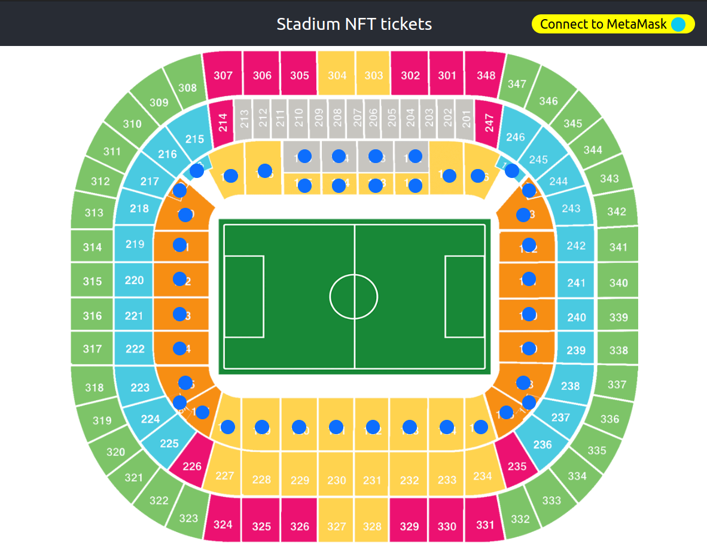
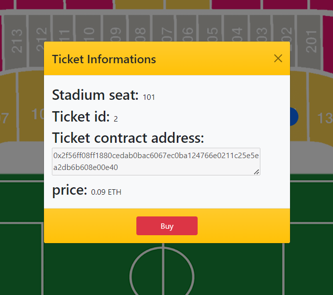

# Footbal tickets platform using NFTs

This project is a prototype that can be used as a baseline for developing various applications that involve selling tickets as NFTs.

Our prototype is based on selling tickets to a football game, but it can really be extended to theatres, operas, baseball games, etc. You can get a feel of how the project works by taking a look at the screenshots below.

## Overview





## Important features

1. The user can login to their MetaMask account and use their Eth to make transactions in the platform
2. You can buy, sell, or refund a ticket you bought

## Prerequisites for running the app

1. Node package manager (npm)
2. Hardhat
	```
	npm install --save-dev hardhat
	```
3. Dotenv
	```
	npm install dotenv --save
	```
4. Ether.js
	```
	npm install --save-dev @nomiclabs/hardhat-ethers ethers@^5.0.0
	```
5. Web3
	```
	npm install @alch/alchemy-web3
	```
6. Create an .env file with the following structure
	```
	API_URL = <Alchemy API endpoint>
	PRIVATE_KEY = <MetaMask private key>
	PUBLIC_KEY = <MetaMask public key>
	```

## How to run the app

```
npm start
```
